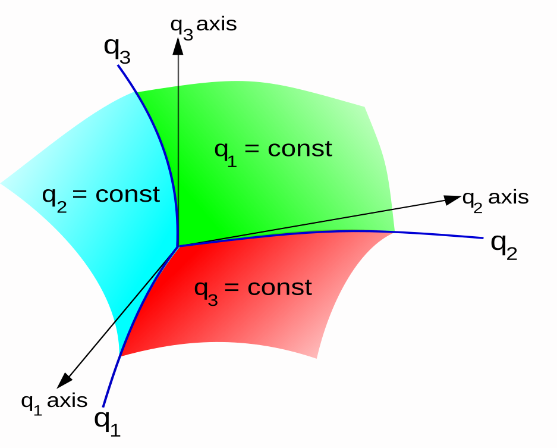
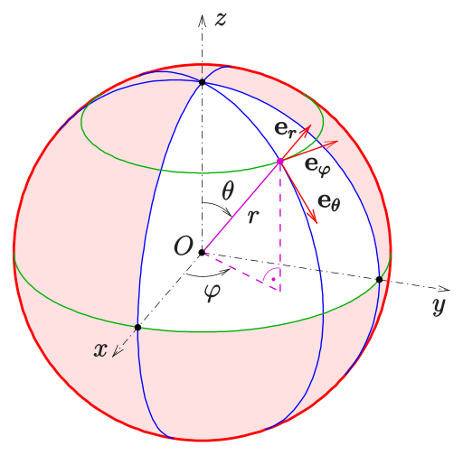

## Curvilinear Coordinates

### Definition

In geometry, curvilinear coordinates are a coordinate system for Euclidean space in which the coordinate lines may be curved. These coordinates may be derived from a set of Cartesian coordinates by using a transformation that is locally invertible (a one-to-one map) at each point.

Note that this means the space itself is still Euclidean (not like general relativity), but the coordinate system is not.

### Coordinates, basis, and vectors

A point $P$ in 3-D space (or its position vector $r$) can be defined using Cartesian coordinates $(x, y, z)$, [equivalently written $(x^1, x^2, x^3)$], by: 
$$\mathbf {r} = x\mathbf {e}_x + y \,\mathbf {e}_y + z \,\mathbf {e}_z$$

where $\mathbf {e}_x, \mathbf {e}_y, \mathbf {e}_z$   are the standard basis vectors. 

It can also be defined by its curvilinear coordinates $(q^1, q^2, q^3)$ if this triplet of numbers defines a **single** point in an _unambiguous_ way. The relation between the coordinates is then given by the invertible transformation functions:

$$x = f^1(q^1, q^2, q^3), \hspace{5mm} y = f^2(q^1, q^2, q^3), \hspace{5mm} z = f^3(q^1, q^2, q^3)$$

The surfaces $q^1 = constant$, $q^2 = constant$, $q^3 = constant$ are called the **coordinate surfaces**; and the space curves formed by their intersection in pairs are called the **coordinate curves**. 

Coordinate surfaces, coordinate lines, and coordinate axes of general curvilinear coordinates.

In the Cartesian system, the standard basis vectors can be derived from the derivative of the location of point $P$ with respect to the local coordinate

$$\mathbf {e} _{x}={\dfrac {\partial \mathbf {r} }{\partial x}};\;\mathbf {e} _{y}={\dfrac {\partial \mathbf {r} }{\partial y}};\;\mathbf {e} _{z}={\dfrac {\partial \mathbf {r} }{\partial z}}.$$

Applying the same derivatives to the curvilinear system locally at point $P$ defines the natural basis vectors: 

$$\mathbf {h} _{1}={\dfrac {\partial \mathbf {r} }{\partial q^{1}}};\;\mathbf {h} _{2}={\dfrac {\partial \mathbf {r} }{\partial q^{2}}};\;\mathbf {h} _{3}={\dfrac {\partial \mathbf {r} }{\partial q^{3}}}.$$

Such a basis, whose vectors _change their direction and/or magnitude from point to point_ is called a **local basis**. All bases associated with curvilinear coordinates are necessarily local. Basis vectors that are the _same at all points_ are **global bases**, and can be associated only with linear or _affine_ coordinate systems. 

These $h_i$ vectors may not have unit length, and may also not be orthogonal. In the case that they are orthogonal at all points where the derivatives are well-defined, we define the Lamé coefficients (aka scaling factors) by

$$h_{1}=|\mathbf {h} _{1}| \hspace{5mm} h_{2}=|\mathbf {h} _{2}| \hspace{5mm} h_{3}=|\mathbf {h} _{3}|$$
## Spherical Coordinates

